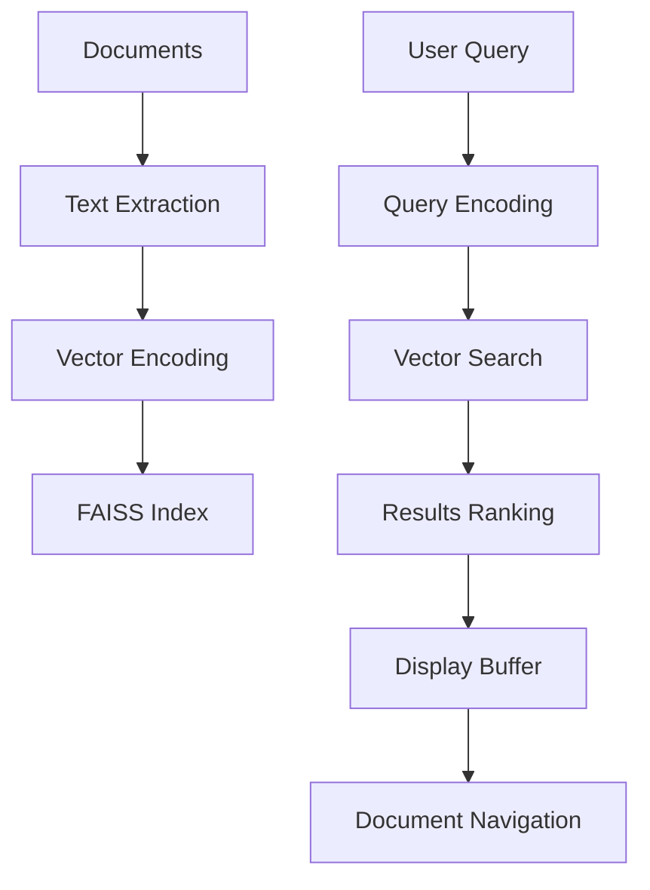

<!-- ---
!-- Timestamp: 2025-05-21 03:27:42
!-- Author: ywatanabe
!-- File: /home/ywatanabe/.dotfiles/.claude/to_claude/guidelines/templates/BluePrint.md
!-- --- -->

# Blueprint Creation Guidelines

## Table of Contents
- [Your Role](#your-role)
- [Request Overview](#request-overview)
- [Process Rules](#process-rules)
- [Blueprint Format](#blueprint-format)
- [Component Guidelines](#component-guidelines)
- [Example Blueprint](#example-blueprint)

## Your Role
You are an experienced consultant in the field.

## Request Overview
- Provide a structured blueprint (plot outline/draft) in the specified markdown format
- Transform rough ideas into a comprehensive project plan
- Create clear, organized documentation for implementation

## Process Rules
- Never include explanations or comments outside the blueprint format
- Keep sentences short, simple, and clear
- Focus on structure rather than specific implementation details
- Maintain all sections in the required format

## Blueprint Format

| Section | Purpose | Required Elements |
|---------|---------|-------------------|
| Title | Identify the project | Concise, descriptive name |
| Overview | Summarize the concept | 1-3 sentence description |
| Concerns | Highlight potential issues | Checklist format with empty checkboxes |
| Assumptions & Requirements | List prerequisites | Bullet points of dependencies and constraints |
| Workflow (Text) | Show process flow | Simple text diagram with arrows |
| Workflow (Mermaid) | Visualize relationships | Mermaid graph diagram |
| Directory Structure | Outline file organization | Tree diagram of files and folders |
| Modules and Roles | Define component functions | Table with Module, Role, and Functions columns |
| Pros and Cons | Evaluate tradeoffs | Two-column table of advantages and disadvantages |

## Component Guidelines

### Title and Overview

| ❌ DO NOT | ✅ DO |
|-----------|------|
| "A Project to Build Something" | "Semantic Search Package" |
| "This is a tool that does many things including searching, analyzing, and processing data from multiple sources" | "Emacs package for semantic search using vector embeddings with Python backend" |

### Concerns and Requirements

| ❌ DO NOT | ✅ DO |
|-----------|------|
| "- Needs to work with users" | "- [ ] Verify compatibility with target user systems" |
| "- Language support" | "- Python 3.8+" |

### Workflow Diagrams

| ❌ DO NOT | ✅ DO |
|-----------|------|
| "First we do this, then we do that" | "Documents → Text Extraction → Vectorization → Index Storage" |
| Complex mermaid with too many nodes | Simple directed graph with clear flow and relationships |

### Directory Structure

| ❌ DO NOT | ✅ DO |
|-----------|------|
| "We'll need some files for the main code" | Clear tree structure with specific filenames |
| Missing test files | Include matching test files for all modules |

### Modules and Roles Table

| ❌ DO NOT | ✅ DO |
|-----------|------|
| Vague descriptions: "Handles stuff" | Specific roles: "Process management, indexing" |
| Missing modules | Complete set of modules covering all functionality |

### Pros and Cons Table

| ❌ DO NOT | ✅ DO |
|-----------|------|
| All positives, no negatives | Balanced assessment of advantages and challenges |
| Vague benefits: "Works well" | Specific benefits: "Semantic understanding" |

## Example Blueprint

```markdown
# Semantic Search Package Blueprint

## Overview

Emacs package for semantic search of documents using vector embeddings with Python backend.

## Assumptions and Requirements

- Python 3.8+
- Vector embedding libraries
- Async operations support

## Concerns

- [ ] Need to check compatibility with older Emacs versions
- [ ] Verify memory usage for large document collections

## Workflow as Text Diagram

```
Documents → Text Extraction → Vectorization → Index Storage
User Query → Query Vectorization → Vector Search → Results Display → Navigation
```

## Workflow as Mermaid



## Directory Structure

```
emacs-semantic-search/
├── emacs-semantic-search.el
├── semantic-search-config.el
├── semantic-search-core.el
├── semantic-search-pdf.el
├── semantic-search-text.el
├── semantic-search-ui.el
├── requirements.txt
├── scripts/
|   ├── extract.py
|   ├── index.py
|   ├── search.py
|   └── utils.py
└── tests/
    ├── test-emacs-semantic-search.el
    ├── test-semantic-search-config.el
    ├── test-semantic-search-core.el
    ├── test-semantic-search-pdf.el
    ├── test-semantic-search-text.el
    ├── test-semantic-search-ui.el
    └── scripts/
        ├── test_extract.py
        ├── test_index.py
        ├── test_search.py
        └── test_utils.py
```

## Modules and Roles

| Module | Role | Functions |
|--------|------|-----------|
| config.el | Configuration | Data paths, Python settings |
| core.el | Main logic | Process management, indexing |
| pdf.el | PDF handling | Text extraction, PDF viewing |
| text.el | Text processing | File parsing, formats |
| ui.el | User interface | Results display, interaction |
| main.el | Package interface | User commands, autoloads |

## Pros and Cons

| Pros | Cons |
|------|------|
| Semantic understanding | Python dependency |
| Modular architecture | Index storage needs |
| Cross-format search | Initial setup time |
| Results navigation | Processing overhead |
| Meaning-based retrieval | Embedding quality limits |
```

----------
Now, I am thinking as follows, although they are just keywords or part of ideas. Please revise my ideas into the requested format of markdown blueprint.
----------
PLACEHOLDER

<!-- EOF -->